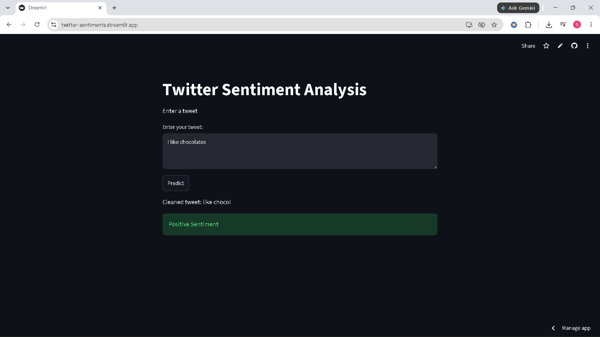
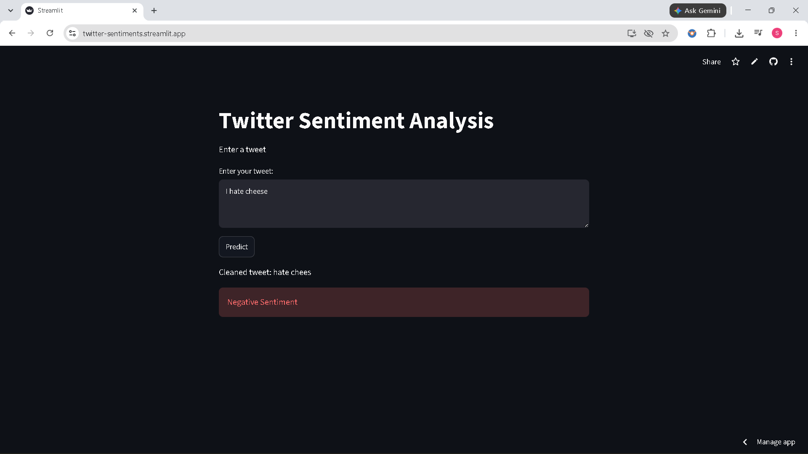

# Twitter Sentiment Analysis

## Overview
A machine learning project that classifies tweets as positive or negative using TF-IDF and Logistic Regression.
The model is trained on the Sentiment140 dataset, containing approximately 1.6 million tweets.

## Live Demo

Try the deployed application: [Twitter Sentiment Analysis](https://twitter-sentiments.streamlit.app)

## Screenshot

## Dataset

- Dataset: Sentiment140
- Tweets: ~1.6 million
- Labels:
  - `0` → Negative
  - `4` → Positive

## Technologies Used

- Python
- Pandas
- NumPy
- NLTK
- Scikit-learn
- Streamlit
- Jupyter Notebook

## Machine Learning Algorithm
Logistic Regression with TF-IDF Vectorization

## Model Performance

- **Accuracy: 77.50%**
- **F1 Score: 78.11%**
